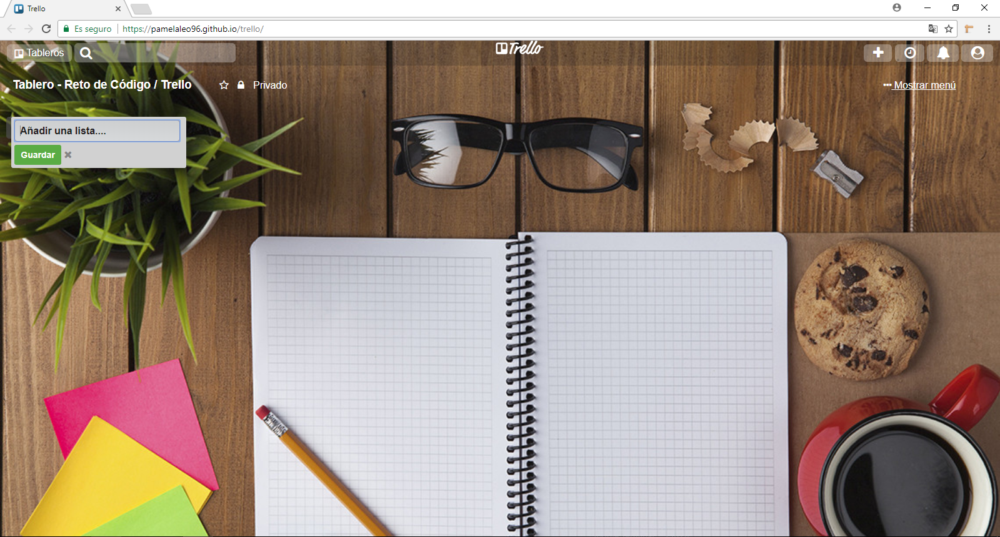

# TRELLO

Este repositorio contiene el desarrollo de maquetacion y animacion sobre la replica del tablero de **(Trello)** poniendo en práctica lo aprendido en clases y el self learnig estructuras HTML, hoja de estilo CSS y utilizando DOM para realizar (animaciones mediante uso de eventos).
- La pagina a replicar es: [página original](https://trello.com/b/WXGwujXH/spring2-maquetado-web-con-html-css).

## Flujo de trabajo: Trabajaremos mediante versiones:

## Versión 0.0.1

* Se mostrará el texto `"Añadir una lista ...".`
* Al hacer click se debe ocultar el texto y mostrar un formulario.
* El formulario está conformado por un input y un botón para que pueda `añadir tareas a tu lista.`

## Versión 0.0.2

* Al dar click en el botón de `"Guardar"`, se mostrará un nuevo cuadro donde estará el nombre de la lista agregada.
 Mostrar un texto de `"Añadir una tarea"` dentro de la lista.

## Versión 0.0.3

* Al dar click en "Añadir una tarea", deberá mostrar un formulario con un textarea y un botón que diga `"Añadir".`

## Versión 0.0.4

* Poner focus al input al dar click en `"Agregar nueva tarea".`
* Al dar click en el botón de `"Añadir"`, deberá aparecer el texto de la tarea debajo del título de la lista.

## Versión 0.0.5 (Extra)

* Mostrar el formulario nuevamente debajo de la última tarea añadida.

## Versión 0.0.6 (Extra)

* Poder agregar múltiples listas con tarjetas. Para esto, el formulario de "Añadir una lista" debe aparecer a la derecha de la lista anteriormente creada.

### Herramientas Utilizadas:
1. HTML5
2. CSS3
3. JS 

## PRODUCTO FINAL
El reto consiste en replicar el tablero de trello.

 
